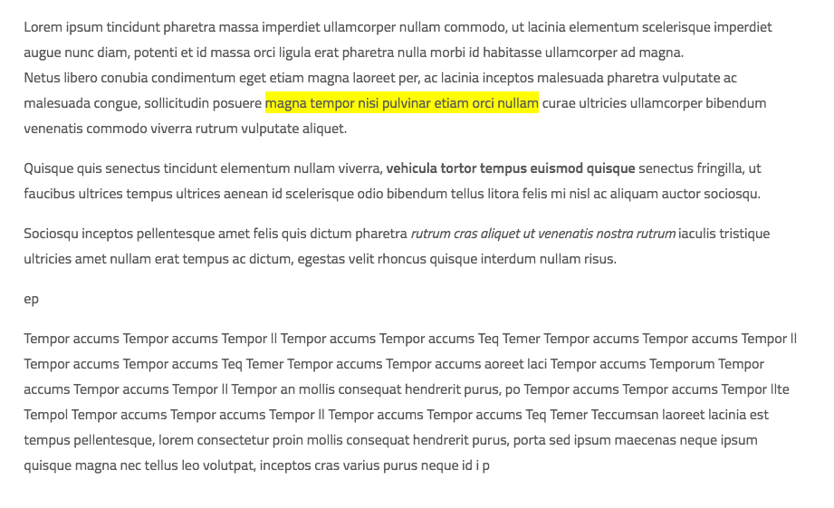

### Content Highlight
One way to highlight text in html content (inspired by Medium's highlight feature)


### How it works
* Given some html content, assign unique identifiers to __every text html node__ in the content with data attribute data-msnode (this can be customized). [ruby sample](./lib/content.rb)
* When text is selected, highlight is created with the first common ancestor html node with a unique identifier for the text range and corresponding start/end offsets. Yes, it works when text range starts in one text node, and ends in another, as long as they share a common ancestral node.
* The common ancestor node identifier, start offset, end offset are sent to the server, where it can be optionally associated with the current user.
* The server returns all highlights as JSON and suitable content highlight classes are applied using rangy's class applier module.
* Highlight removal permissions can also be set by the server. Clicking on a highlight will provide a link to remove the highlight.
* Removing a highlight will send request the server for acknowledgment

### Setup
Include the [javascript file](./content_highlight.js)(and [jquery](./content_highlight.jquery.js) if needed) files and Rangy modules to your page
```
<head>
  <!-- You can find the latest rangy release at https://github.com/timdown/rangy/releases -->
  <script type="text/javascript" src="path/to/rangy-core.js"></script>
  <script type="text/javascript" src="path/to/rangy-classapplier.js"></script>
  <script type="text/javascript" src="//path/to/content_highlight.js"></script>
  <script type="text/javascript" src="//path/to/content_highlight.jquery.js"></script>
</head>
```
If the html nodes in the content are tagged as below

```
<div id="content_container">
  <p data-msnode="ab14313b">
    <p data-msnode="fc86190d">
      Quisque quis senectus tincidunt elementum nullam viverra,
      <b data-msnode="d3e32d2">
        vehicula tortor <em data-msnode="ded1312e">tempus euismod</em> quisque
      </b>
      senectus fringilla, ut faucibus ultrices tempus ultrices aenean id scelerisque odio bibendum tellus litora felis mi nisl ac aliquam auctor sociosqu.
    </p>
    <p data-msnode="9a772fd1">
      Sociosqu inceptos pellentesque amet felis quis dictum pharetra
      <em data-msnode="daed1212">
        rutrum cras aliquet ut venenatis nostra rutrum
      </em>
      iaculis tristique ultricies amet nullam erat tempus ac dictum, egestas velit rhoncus quisque interdum nullam risus.
    </p>
  </p>
</div>
```
then
```
<script type="text/javascript">
  setTimeout(function(){
    var worker = new contentHighlightWorker(document.getElementById('content_container'), {
      nodeIdentifierKey: 'msnode',
      addToServerPath: '/contents/123/add_content_highlights',
      removeFromServerPath: '/contents/123/remove_content_highlights'
    });
    worker.init();
  }, 10);
</script>
```
or, in jquery
```
<script type="text/javascript">
	$('#content_container').contentHighlighter({
		nodeIdentifierKey: 'msnode',
    addToServerPath: '/contents/123/add_content_highlights',
    removeFromServerPath: '/contents/123/remove_content_highlights'
	})
</script>
```

### Options Configuration
* __nodeIdentifierKey__: data attribute key of unique node identifiers _(default: msnode)_
* __highlightClass__: CSS class added to highlight span _(default: content-highlight)_
* __highlightIdentifyClassRoot__: Root word for the CSS class that is added to highlights (e.g. content-highlight-identifier-11) _(default: content-highlight-identifier-)_
* __highlightLifetimeClassRoot__: Root word for CSS classes that will be added to highlights through its lifetime. This is particularly used to distinguish the highlights by different users (e.g. content-highlight-lifetime-me vs content-highlight-lifetime-others)  _(default: content-highlight-lifetime-)_
* __highlightActiveClass__: CSS class added to active highlight _(default: content-highlight-active)_
* __popTipClass__: CSS class added to the popTip that is shown when highlight is clicked _(default: content-highlight-poptip)_
* __popTipDefaultHead__: Text header in the popTip _(default: Highlight)_
* __addToServerPath__: Path to Add highlight to Server _(default to the element's data attribute: element.dataset.addhighlightspath)_
* __removeFromServerPath__: Path to Remove highlight from Server _(default to the element's data attribute: element.dataset.removehighlightspath)_
* __readOnly__: Highlights are readonly and not clickable _(default: false)_

### Adding, Removing and Fetching highlights
See [rails controller sample](./lib/content_highlights_controller.rb)
* Add highlights
When a text range is selected, the following params are sent to addToServerPath
```
{  
  :content => "hello world was selected",
  :common_ancestor_identifier_key => "msnode", # nodeIdentifierKey
  :common_ancestor_identifier => "fc86190d",
  :common_ancestor_node_type => "p", #text node p
  :start_offset => 33,
  :end_offset => 123,
  :backward => true, # denotes the direction of selection
}
```
After storing this highlight, the server must return *all the highlights* relevant to that content as json
```
[
  {
    "identifier": highlight.id,
    "description": "Highlighted by #{highlight.user.full_name}",
    "can_cancel": (highlight.user_id == current_user.id or current_user.is_admin?),
    "life_time_class_ends": ((highlight.user_id == current_user.id) ? "me" : "others"),
    "content": highlight.content,
    "backward": highlight.selection_backward,
    "start_offset": highlight.startnode_offset,
    "end_offset": highlight.endnode_offset,
    "common_ancestor_identifier": highlight.container_node_identifier,
    "common_ancestor_node_type": highlight.container_node_type
  }
]
```
And, highlights will be shown only if and only if the start_offset, end_offset, content, common_ancestors all match.
* Remove highlights
When a highlight is clicked, a pop tip is shown with a link to remove that highlight if the user has permission to do so
send the highlight's id to removeFromServerPath
```
{
  content_highlight_id: 123,
}
```
After removing the highlight, the server acknowledges by returning the removed highlight
```
{
  "identifier": highlight.id,
  "description": "Highlighted by #{highlight.user.full_name}",
  "can_cancel": (highlight.user_id == current_user.id or current_user.is_admin?),
  "life_time_class_ends": ((highlight.user_id == current_user.id) ? "me" : "others"),
  "content": highlight.content,
  "backward": highlight.selection_backward,
  "start_offset": highlight.startnode_offset,
  "end_offset": highlight.endnode_offset,
  "common_ancestor_identifier": highlight.container_node_identifier,
  "common_ancestor_node_type": highlight.container_node_type
}
```
* Fetching highlights
Since addToServerPath returns all the highlights anyways, we send empty params and receive all the highlights from the server as json

### Dependencies
Text selection is supported by [Rangy](https://www.github.com/timdown/rangy)
* [Rangy's Core module](https://github.com/timdown/rangy/blob/master/src/core/core.js)
* [Rangy's Class Applier Module](https://github.com/timdown/rangy/blob/master/src/modules/rangy-classapplier.js)


### License
MIT
